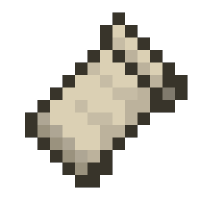
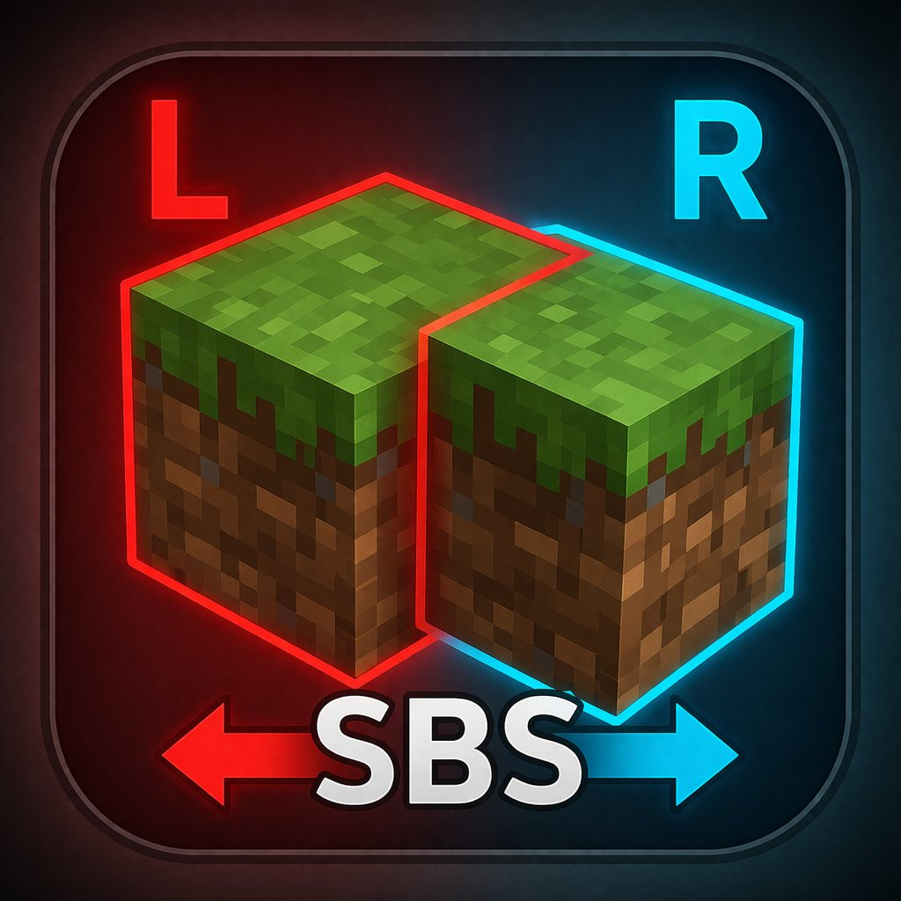

      

#  SBSShot

 

> 🇯🇵 [日本語はこちら](README_ja.md)

 

**SBSShot** is a Minecraft mod that captures **Side-by-Side (SBS) stereo screenshots** for VR/HMD devices.

Press **.** to save a `.png` file containing left-eye and right-eye views side by side.

---

## Preview

You can view `.png` files with the **SBS Stereo Viewer**:

👉 **[https://azo234.github.io/sbs-stereo-viewer/](https://azo234.github.io/sbs-stereo-viewer/)**

---

## Features

- Captures SBS stereo screenshots with **.**
- Outputs `.png` format
- Saved to `.minecraft/screenshots/stereo/stereo_YYYY-MM-DD_HH.mm.ss.png`
- Configurable parallax (default: 6.5 cm) and output subdirectory
- HUD-free rendering — ideal for VR/HMD use
- Supports **NeoForge**, **Fabric**

---

## Installation

Place the mod `.jar` in your `.minecraft/mods/` folder.

For **Fabric**, install these dependency mods as well:

- **Fabric API**  
  https://modrinth.com/mod/fabric-api  
  https://www.curseforge.com/minecraft/mc-mods/fabric-api
- **Mod Menu**  
  Optional, but recommended for opening the in-game config screen.  
  https://modrinth.com/mod/modmenu  
  https://www.curseforge.com/minecraft/mc-mods/modmenu

For **NeoForge**, no additional dependency mods are required.

---

## Configuration

| Key | Default | Description |
|-----|---------|-------------|
| `parallax_cm` | `6.5` | Camera separation in centimeters |
| `output_sub_dir` | `stereo` | Subdirectory inside `screenshots/` |

Settings can be changed in-game via the **Mod Menu** (Fabric) or the **Config** screen (NeoForge).

---

## Key Binding

| Key | Action |
|-----|--------|
| . | Capture SBS stereo screenshot |

---

## Technical Notes

The mod renders the scene twice — once for the left eye and once for the right eye — with a horizontal camera offset matching the configured parallax. Rendering reads directly from the main render target FBO to ensure accurate frame capture.

### Minecraft 26.1 API Notes

- `Camera.setup()` was removed → replaced with `Camera.update(DeltaTracker)` + `Camera.setPosition(Vec3)`
- `renderLevel()` writes to `mainRenderTarget` (FBO), not the screen buffer → FBO ID obtained via `GlTexture#firstFboId`
- `ResourceLocation` → `Identifier`
- `KeyBindingHelper` → `KeyMappingHelper`

---

## License

MIT

## Link

[Modrinth](https://modrinth.com/project/sbsshot)  
[CurseForge](https://legacy.curseforge.com/minecraft/mc-mods/sbsshot)
